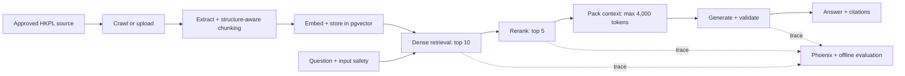
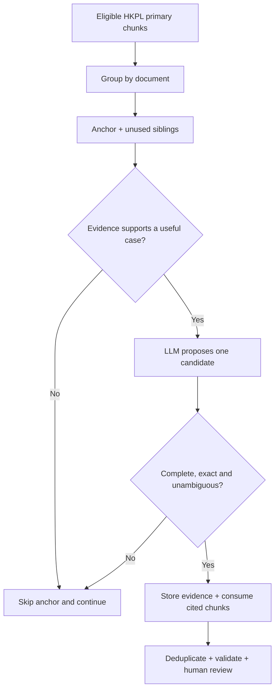

# HKPL Agentic RAG

[GitHub repository](https://github.com/claranatalie01/hkpl_multiformat_patch)

## Executive summary

The PoC evaluates an internally hosted RAG system on approved Hong Kong Public
Libraries (HKPL) webpages and documents. It covers ingestion, retrieval,
reranking, grounded generation, input safety, evaluation, and tracing.

**Scope:** The measured results focus on the RAG path: ingestion, retrieval,
reranking, context construction, and answer generation. 

The tests support the following configuration:

- Qwen3 Embedding 0.6B Q8_0;
- dense retrieval, top 10;
- Qwen3 Reranker 0.6B Q8_0, top 5;
- deterministic context packing, maximum 4,000 tokens;
- Qwen3.5-9B Q6_K generation with reasoning disabled; and
- GLiGuard as the low-latency input-safety candidate.

**Headline result:** On 128 HKPL questions, this configuration achieved 90.63%
Retriever Hit@10, 83.59% Reranker Hit@5, 87.50% answer pass, 97.66%
faithfulness, and 1.93 / 3.05 seconds p50 / p95 latency.

## 1. Methodology

The workflow follows one controlled path from source to answer:



### 1.1 Runtime architecture

The runtime places five supporting services and the LangGraph agent in six
containers. This separation allows one model service to be replaced and tested
without rebuilding the rest of the system.

| Container | Role |
|---|---|
| PostgreSQL + pgvector | Stores sources, chunks, metadata, vectors, evaluation rows, and conversation state. |
| Embedding server | Embeds stored chunks and incoming queries. |
| Reranker server | Rescores retrieved candidates. |
| LLM server | Supports bounded classification and grounded answer generation. |
| LangGraph agent | Runs safety, routing, retrieval, context packing, generation, validation, and fallback. |
| Phoenix | Displays OpenTelemetry traces and evaluation results during development. |

Local model serving keeps HKPL evidence and user questions off public AI
services. LangGraph provides a finite workflow, not an open-ended planning
loop. PostgreSQL replaces a separate FAISS index, so vectors, metadata,
versions, filters, backups, and corpus activation stay in one database. The
container boundaries simplify model A/B tests; the transactional database
keeps the corpus traceable.

### 1.2 Building the knowledge corpus

`scripts/crawl_hkpl_site.py` starts from approved `www.hkpl.gov.hk` sections:
services, e-resources, collections, locations, notices, activities, and FAQs.
It follows approved English, Traditional Chinese, Simplified Chinese, and PDF
links. Page, depth, delay, file-type, path, and `robots.txt` rules bound the
crawl.

The crawler downloads pages with `requests`. Beautiful Soup extracts the main
content, title, and links. The crawler saves new or changed content with its
checksum and version, then passes it to the same ingestion service as an
uploaded document.

The reader is selected by source structure:

- custom Beautiful Soup readers preserve HKPL events, opening-hours rows,
  branch tabs, forms, and FAQ pairs;
- CSV, XLSX, JSON, and XML use deterministic record readers;
- Docling handles general PDF, Office, Markdown, text, image, and HTML layouts;
- Docling's PDF pipeline has Tesseract OCR enabled for scans and image regions.

LlamaIndex is retained for its `Document`/`TextNode` interfaces and pgvector
integration. However, general-purpose components such as
`SimpleDirectoryReader`, `SentenceSplitter`, and `TokenTextSplitter` did not
reliably preserve HKPL-specific tables, repeated events, FAQs, and source
locators, so custom readers and structure-aware chunking were implemented.

### 1.3 Chunking method

The pipeline uses **two-stage, structure-aware, record-preserving,
token-bounded chunking**, not fixed windows for every source.

```text
Extract a logical record
        -> keep it whole when it fits within 512 tokens
        -> otherwise split at paragraphs, lists or sentences
        -> use overlapping token windows only as a final fallback
        -> create a traceable vector node
```

**Stage 1 — preserve meaning.** Readers create logical records:

- an FAQ keeps its question with its answer;
- an event or notice keeps its title, date, time and venue together;
- a branch profile keeps each addressable section together;
- an opening-hours, schedule, CSV or spreadsheet row keeps its column headers;
- JSON and XML retain record boundaries; and
- Docling uses document structure to preserve headings, prose sections, tables
  and page locators in PDFs and other general documents.

**Stage 2 — enforce the limit.** The chunk builder adds the source title,
heading path, aliases, or record header to the exact evidence. It measures this
`search_text` with the embedding tokenizer. Records within 512 tokens stay
whole. Larger records split at paragraphs, list items, or English/Chinese
sentences. Only oversized semantic units use 64-token overlapping windows;
atomic Docling table rows use no overlap.

Split records repeat the FAQ question, table header, or record header when
needed. Each chunk stores exact `evidence_text`, enriched `search_text`, and
provenance. Its ID combines the source version, locator, part number, and
evidence hash.

One chunk per page proved too broad, while fixed windows could separate an
event from its schedule or a value from its table header. The selected method
keeps records intact before enforcing the model limit.

### 1.4 Evaluation dataset generation

The generator draws questions only from HKPL chunks marked `primary`. All 128
rows are validated against the vector table. The anchor-and-sibling method
keeps the expected evidence complete.



The LLM may skip weak, incomplete, conflicting, navigation-only, or form-only
evidence. A skipped anchor creates no row. Deterministic checks also reject
invalid questions, answers, snippets, and chunk IDs. The target count never
forces acceptance of a poor question.

For repeated events or services, the generator checks every sibling about the
same subject. A general question must cover all matching dates, venues, or
branches. A single-occurrence question must name its exact date and location.
Snippets must be exact text, and every snippet must have a matching chunk ID.
Cited chunks are then consumed so they cannot create paraphrased duplicates.
Matching duplicates keep the best-supported row; conflicting versions are
removed.

A question answerable from three sibling chunks must label all three, not only
its anchor. This is the main reason for using sibling evidence.

#### Repeated-event example

Suppose one HKPL webpage produces four chunks:

| Chunk | Content |
|---|---|
| A | The named talk takes place on 16 September. |
| B | The same talk takes place on 23 September. |
| C | The same talk takes place on 30 September. |
| D | A different event on the same webpage. |

The earlier method could ask “When is the talk held?” from A and save only 16
September. That label was incomplete. An answer containing all three dates
could be judged wrong, while retrieval of B or C could be recorded as a miss.

The generator uses A as the anchor and supplies B, C, and D as siblings. The
LLM identifies A, B, and C as the same talk. An unscoped question must store:

```text
expected_answer_text            = 16, 23, and 30 September
expected_context_snippets_json  = [snippet from A, snippet from B, snippet from C]
source_chunk_ids_json           = [A, B, C]
```

The arrays are parallel: each snippet maps to its chunk ID. For compatibility,
`source_chunk_id` keeps the first ID; `source_chunk_ids_json` stores the full
gold set. Once accepted, A, B, and C cannot create another question in the
same case/language slice. D remains available because it was not cited.

```text
A, B, C -> cited evidence -> consumed
D       -> unrelated and uncited -> still available
```

If a question names one exact date and venue, it may cite only that occurrence.
Other occurrence chunks remain available for equally specific questions. This
removes duplicates without treating every chunk on a page as the same fact.

The same rule covers repeated services, workshops, exhibitions, branch
sessions, and multi-venue activities.

### 1.5 Distractor design and metrics

The benchmark search table contained 16,220 chunks:

- 2,668 HKPL primary chunks;
- 9,769 [HotpotQA](https://huggingface.co/datasets/hotpotqa/hotpot_qa)
  distractor chunks; and
- 3,783 [Webz News](https://github.com/Webhose/free-news-datasets)
  distractor chunks.

HotpotQA adds multi-document Wikipedia material; Webz adds news across topics
and publishers. Both create plausible competition for HKPL chunks.
Distractor Rate@5 measures how much survives reranking. These datasets are test
controls, not approved answer sources.

All comparisons used the same 128 questions, corpus, top-k values, answer
model, and reasoning setting.

| Metric | What it measures | Why it is used |
|---|---|---|
| Evaluation coverage | Questions with valid expected evidence in the active vector table | Prevents missing or stale labels from being mistaken for RAG failures. |
| Retriever Hit@10 | Labelled or accepted evidence found in the first ten candidates | Isolates embedding and retrieval quality before reranking. |
| Reranker Hit@5 | Labelled or accepted evidence retained in the final five | Shows whether reranking helps or removes correct evidence. |
| Distractor Rate@5 | Final chunks from HotpotQA or Webz News | Measures resistance to plausible but non-HKPL content; lower is better. |
| Answer pass rate | Answers meeting the evaluation pass criteria | Gives one end-to-end success rate. |
| Q&A Correctness | Agreement with the reviewed answer, scored out of five | Detects missing, incorrect, or contradictory details. |
| Faithfulness | Claims supported by the context given to the LLM | Detects unsupported generation or hallucination. |
| Relevancy | Whether the answer directly addresses the question | Catches grounded but off-topic answers. |
| RAG Diagnosis | Combined retrieval, reranking, evidence, and answer outcome | Assigns a likely failure stage for debugging. |
| Token usage | Embedding, reranker, context, prompt, completion, and pipeline tokens | Explains compute cost and differences in latency. |
| p50 / p95 latency | Typical and slow-tail end-to-end response time | Shows both normal user experience and outlier risk. |

Hit rates, distractor rate, token counts, and latency are deterministic.
Correctness, faithfulness, and relevancy use the configured local judge, so
release decisions must also include human review of a representative sample.

## 2. Experimental results

### 2.1 Dense versus hybrid retrieval

QE = Qwen3 Embedding 0.6B and QR = Qwen3 Reranker 0.6B. Both are Q8_0.

| Configuration | Retriever Hit@10 | Reranker Hit@5 | Answer pass | Correctness /5 | Faithfulness | Pipeline tokens | p50 / p95 |
|---|---:|---:|---:|---:|---:|---:|---:|
| **QE + dense + QR** | **90.63%** | **83.59%** | 87.50% | **4.578** | **97.66%** | **3,782.9** | **1.93 / 3.05 s** |
| QE + hybrid + QR | 89.06% | 82.03% | 87.50% | 4.563 | 96.09% | 4,420.2 | 5.72 / 7.38 s |

**Retrieval decision:** Hybrid retrieval found fewer labelled chunks, used
16.8% more tokens, and nearly tripled p50 latency. It did not improve answer
pass rate, so dense top-10 retrieval was retained.

The [ACM retrieval study](https://dl.acm.org/doi/10.1145/3816713.3818802)
reports strong overall retrieval effectiveness for dense retrieval. The HKPL
benchmark aligns with that finding: dense retrieval produced higher retriever
and reranker hit rates, slightly better correctness and faithfulness, lower
token use, and much lower latency than the tested hybrid configuration.

### 2.2 Embedding and reranker comparison

JE5 = Jina Embeddings v5 small; JR3/JR3.5 = Jina reranker v3/v3.5. All
variants used Q8_0, dense top 10, rerank top 5, and reasoning-off generation.

The embedding A/B tests kept chunk text, metadata, and IDs fixed in separate
vector tables; only the vectors changed. Experiment branches and Compose
overrides isolated the Jina services from the baseline.

| Configuration | Retriever Hit@10 | Reranker Hit@5 | Answer pass | Correctness /5 | Faithfulness | Pipeline tokens | p50 / p95 |
|---|---:|---:|---:|---:|---:|---:|---:|
| QE + dense + JR3 | **90.63%** | 82.03% | **89.84%** | **4.625** | **97.66%** | 3,953.3 | 8.30 / 13.09 s |
| QE + dense + JR3.5 | **90.63%** | 80.47% | 89.06% | **4.625** | 96.09% | 3,926.7 | **1.87 / 2.94 s** |
| JE5 + dense + QR | 87.50% | 81.25% | 88.28% | 4.539 | 93.75% | 4,015.9 | 2.00 / 3.16 s |
| JE5 + dense + JR3.5 | 87.50% | 79.69% | 85.94% | 4.477 | 92.19% | 4,010.5 | 1.90 / 3.04 s |

**Model decision:** Qwen embedding found labelled evidence for 116/128
questions; Jina v5 found 112/128. Jina v3 had the highest answer pass rate but
was too slow through the tested GGUF path. Jina v3.5 was fast, but Qwen
reranking kept four more labelled chunks and had higher faithfulness for only
0.06 seconds more p50 latency. These results support Qwen3 Embedding 0.6B Q8_0
and Qwen3 Reranker 0.6B Q8_0 for the current baseline.

### 2.3 Why Jina's published ranking differs from this PoC

Published rankings and this PoC measure different systems. The
[Jina model page](https://jina.ai/models/jina-embeddings-v5-text-small/)
reports strong aggregate MTEB results, and the AIMultiple
[embedding](https://aimultiple.com/open-source-embedding-models) and
[reranker](https://aimultiple.com/rerankers) studies also rank Jina highly.
Their experimental conditions differ from this PoC:

| Factor | Published benchmark | HKPL PoC |
|---|---|---|
| Data | General multilingual/English benchmarks, legal contracts, technical documents, medical abstracts, or English Amazon reviews | HKPL webpages and PDFs containing branch names, event schedules, tables, URLs, English, and Chinese |
| Candidate flow | Embedding ranking across large corpora; reranking top 100 into top 10 | Dense top 10 reranked into top 5 |
| Metrics | Aggregate MTEB, nDCG, MRR, Recall, or product-level hits | Exact labelled HKPL chunk hits, answer correctness, faithfulness, tokens, and end-to-end latency |
| Runtime | Full Hugging Face weights through vLLM or Transformers/PyTorch on an H100 80 GB | Q8_0 GGUF services on RTX 2080 Ti hardware |
| Model recipe | Official task adapter, pooling, query/document prefixes, and backend | PoC GGUF adapter path, whose parity with the official recipe must be checked |

Jina v5 expects its retrieval configuration and asymmetric query/document
treatment. Adapter, prefix, pooling, normalization, or tokenizer differences
can reduce quality even when the server returns valid vectors. Q8_0 and a
different backend can also shift close rankings. The reranker article compares
Jina v3 with Qwen 4B; this PoC uses Qwen3 Reranker 0.6B Q8_0.

Only four retrieval hits separate Qwen and Jina v5, and no confidence interval
was calculated. Jina also had a higher answer pass rate in some runs. The
result supports Qwen for this setup; it does not prove that Qwen is always
better. A follow-up should verify Jina's official recipe and use repeated,
paired per-question runs. External benchmarks shortlist models; the HKPL
benchmark selects the deployment model.

### 2.4 Context and answer generation

After reranking, the system packs chunks by score up to 4,000 generation
tokens. Five chunks of at most 512 embedding tokens normally fit. The answer
tokenizer measures the final context, including source labels.

Create-and-Refine and hierarchical summarisation require several LLM calls.
They add latency, may lose details, and weaken the link to exact source text.
Deterministic packing uses one call and preserves citation evidence.

The PoC uses deterministic context packing and one bounded generation call.

### 2.5 Input-safety benchmark

[WildGuardTest](https://huggingface.co/datasets/allenai/wildguardmix) contained
1,725 prompts. The test used the 1,699 prompts with harmfulness labels: 945
safe and 754 unsafe. Every policy processed every scorable row.

| Policy | Accuracy | Unsafe precision | Unsafe recall | Unsafe F1 | FPR / FNR | Mean latency |
|---|---:|---:|---:|---:|---:|---:|
| **GLiGuard** | 82.52% | 76.91% | **86.60%** | 81.47% | 20.74% / **13.40%** | **16.7 ms** |
| Qwen3Guard loose | 88.70% | **93.10%** | 80.50% | 86.34% | **4.76%** / 19.50% | 248.3 ms |
| Qwen3Guard strict | **90.23%** | 91.88% | 85.54% | **88.60%** | 6.03% / 14.46% | 248.3 ms |

Accuracy measures all correct classifications. Unsafe precision asks how many
blocked prompts were truly unsafe; unsafe recall asks how many unsafe prompts
were caught. F1 balances those two measures. FPR is the share of safe prompts
blocked, while FNR is the share of unsafe prompts allowed. Latency measures the
guard's added response time.

**Safety decision:** GLiGuard was about 15 times faster and had the highest
unsafe recall, supporting its selection as the latency-first PoC guard. Its 20.74%
false-positive rate is the main trade-off. Before production, it needs
HKPL-specific multilingual and jailbreak calibration. It supplements
deterministic rules, authorization, grounding, output checks, and rate limits;
it does not replace them.

## 3. Problems found and design decisions

### Missing details from a correct context

One source listed “Arts, Business, Food and Nutrition, Health, Humanities,
Medicine, Music, News, Religion, Social Science.” Without reasoning, the answer
omitted “Religion.” A 1,000-token reasoning budget kept it but raised latency
from about 3 to 15 seconds. Across tests, reasoning-off took 2–3 seconds;
reasoning-on took 8–15 seconds.

Reasoning remains off for ordinary questions. A future complexity classifier
could reserve it for multi-item, comparison, date-resolution, or multi-hop
questions, but that route needs its own evaluation.

### Exact URL and identifier questions

Semantic retrieval missed the labelled record for “What is the URL for the
Tung Wah Museum - Reference Library?” URLs and identifiers are poor semantic
targets.

Future work will route exact titles, URLs, branches, and identifiers to a
typed, read-only metadata lookup. The result will use the same grounding and
output checks. The model may choose this route but must not write SQL.

### Reproducibility and service readiness

Runs also exposed four operational problems:

- scheduled ingestion changed source versions and chunk IDs;
- loading model services returned 503 responses;
- `&` and `&amp;` caused evidence mismatches; and
- reranker failures could silently fall back to dense order.

The controls are corpus locks, readiness checks, comparison-time text
normalization, versioned benchmark inputs, and rejection of runs with fallback
warnings.

## 4. PoC conclusion and next steps

**PoC verdict:** Use **Qwen embedding + dense top 10 + Qwen reranker top 5 +
deterministic context + reasoning-off generation**. Use GLiGuard as the
low-latency guard candidate after false-positive calibration.

Before production, complete these items:

- a fully reviewed multilingual benchmark;
- calibrated answerability thresholds and exact-metadata routing;
- source-approval and access-isolation tests;
- model licence and failure-recovery reviews; and
- concurrent capacity testing.

## References

- [HKPL PoC source repository](https://github.com/claranatalie01/hkpl_multiformat_patch)
- [HotpotQA dataset](https://huggingface.co/datasets/hotpotqa/hotpot_qa)
- [Webz free news datasets](https://github.com/Webhose/free-news-datasets)
- [Jina Embeddings v5 text small](https://jina.ai/models/jina-embeddings-v5-text-small/)
- [AIMultiple open-source embedding benchmark](https://aimultiple.com/open-source-embedding-models)
- [AIMultiple reranker benchmark](https://aimultiple.com/rerankers)
- [ACM lexical, dense, and hybrid retrieval study](https://dl.acm.org/doi/10.1145/3816713.3818802)
- [WildGuardTest dataset](https://huggingface.co/datasets/allenai/wildguardmix)

Implementation details are maintained in [architecture.md](architecture.md),
[ingestion.md](ingestion.md), [evaluation.md](evaluation.md),
[operations.md](operations.md), and [development.md](development.md).
